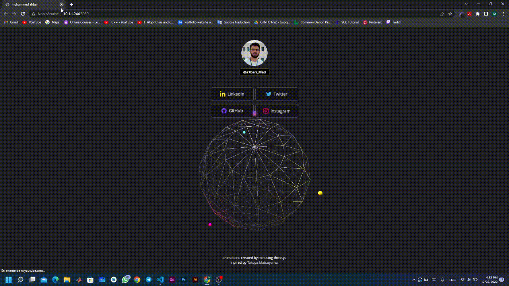

# Link in bio with 3d animation 
this project is an inspiration by Takuya Matsuyama's [video](https://www.youtube.com/watch?v=u71pHOyvBp0&t=2s)

## Features

- Modern UI Design
- 3d animation using three.js
- Webpack as a module bundler
- Fully Responsive

## demo

**To view the demo:** [**click here**](https://ahbari-m.github.io/ahbari-link-in-bio/)



## How To Use

From your command line :

```
# Clone the repository
$ git clone https://github.com/Ahbari-M/ahbari-link-in-bio.git

# Move into the repository
$ cd ahbari-link-in-bio
```

## Setup
Download [Node.js](https://nodejs.org/en/download/).
Run this followed commands:

``` bash
# Install dependencies (only the first time)
npm install

# Run the local server at localhost:8080
npm run dev

# Build for production in the dist/ directory
npm run build
```
